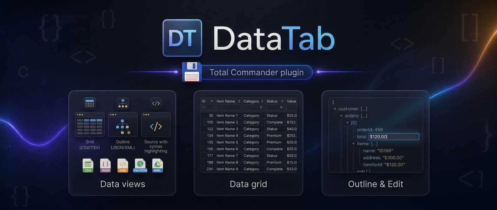
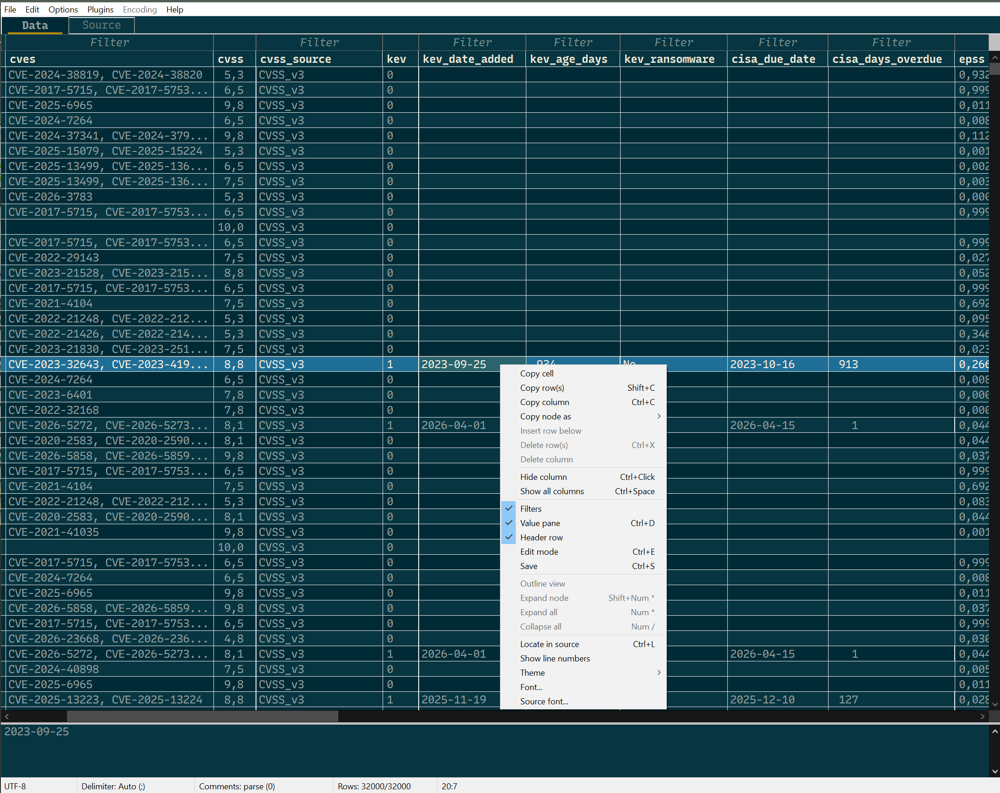
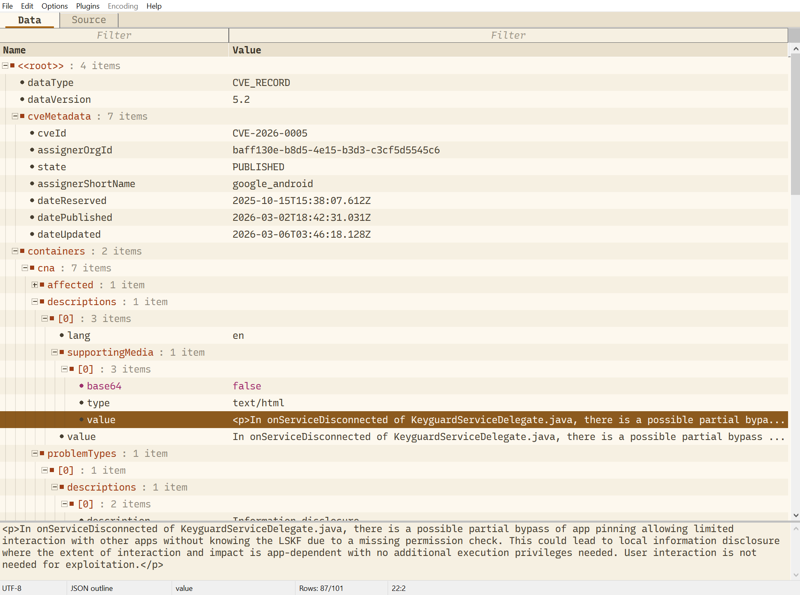
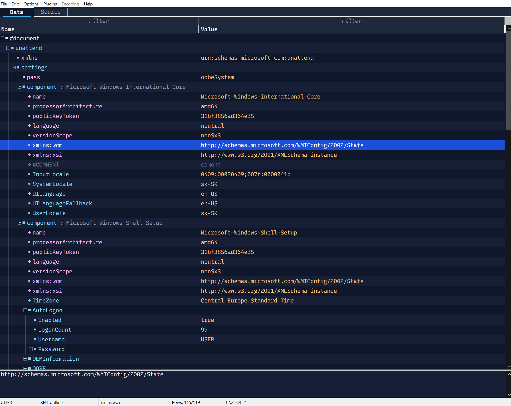
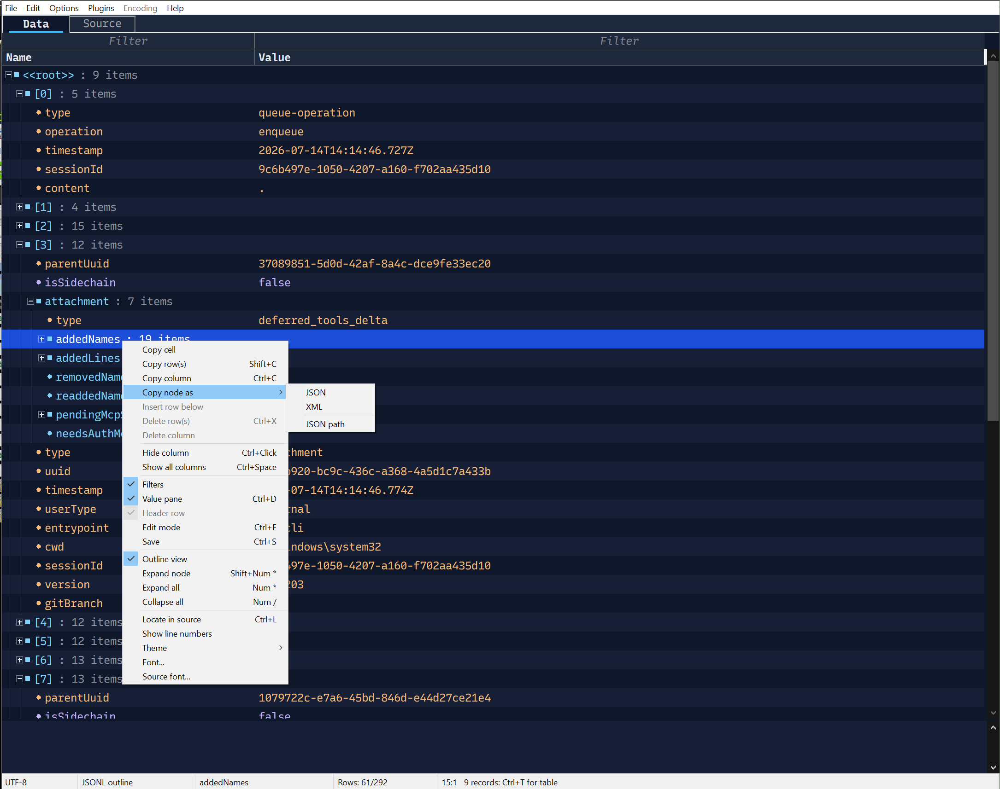

# DataTab

## News

**2026-10-02 — DataTab 1.5: databases, spreadsheets and conversion**

DataTab is no longer only a text-file viewer. Version 1.5 opens databases
and spreadsheets in Lister, and turns any of them into CSV or JSON.

- **SQLite databases.** `.db`, `.sqlite`, `.sqlite3`, `.db3`, `.s3db`,
  `.sl3`, plus GeoPackage (`.gpkg`) and MBTiles (`.mbtiles`). A navigator
  lists every table and view with its row count and unfolds to columns,
  indexes and triggers. Column headers show types and the primary key;
  NULL and blobs are shown for what they are (a blob as a hex dump).
- **SQL in Lister.** A Query tab runs your own SQL with highlighting,
  error underlining, history and cancel. The results land in the same
  grid, so you can filter, sort and copy them. Only queries that read are
  allowed, so the file is never changed.
- **Excel workbooks,** old and new: `.xls` (Excel 5.0 to 2003) and `.xlsx` /
  `.xlsm` from Excel 2007 up to the current Microsoft 365, plus
  the templates. Every sheet is a table in the navigator, with column
  names from the header row. Dates read as dates, formulas as their
  results, and percent, currency and fractions as Excel shows them.
- **DBF tables.** dBASE III to 7, FoxPro, Visual FoxPro and Clipper,
  with their memo files. The code page is detected, the DOS ones
  (Kamenický, Mazovia) included.
- **SQL over spreadsheets and DBF.** Run the same Query tab over Excel
  sheets and DBF tables, e.g. `SELECT customer, SUM(total) FROM Orders
  GROUP BY customer`.
- **Export and convert.** Save to CSV, TSV or JSON:
  - the view as filtered and sorted;
  - only the selected rows;
  - a whole sheet or table, from the navigator;
  - a query's result.

  This works from any format DataTab opens, so Excel to CSV, DBF to CSV,
  JSON to CSV, or a SQL query over a workbook to JSON are each one step.
- **Big tables, whole.** Filters and sorting cover every row of a table,
  even one far bigger than what is loaded on screen.
- **Totals for the selection.** The status bar shows Count, Sum, Avg, Min
  and Max of the selected cells.

Also new: N / P move to the next file in the same Lister window; Lister's
Copy, Select all and ANSI / ASCII work; DOS and other code pages are in
the encoding menu. Every file reader was tested against millions of
damaged files, and one `.xlsx` crash was fixed.

**2026-09-29 — DataTab 1.4**

- **32-bit version.** DataTab now runs in 32-bit Total Commander as well as
  64-bit (`datatab.wlx` next to `datatab.wlx64`, one package).
- **More file types:** YAML (`.yaml`, `.yml`, `.clang-format`,
  `.clang-tidy`), TOML, INI (`.ini`, `.editorconfig`), Java `.properties`
  and `.env` files. They open in the same outline as JSON, and edits keep
  their comments and layout.
- **Rename keys** in the outline, and **Copy node as YAML** from any format.
- **Wildcards** (`*`, `?`) in the filter boxes.
- **Links open** in the default browser with a double-click on the cell,
  or from the context menu.
- **Simpler selection,** like a spreadsheet: no striped rows or hover
  highlight, and selected text keeps its color.
- **The theme follows Total Commander's** light or dark mode by default.
- A file too large for the available memory now gives a clear message
  instead of taking Total Commander down.

Full history: [version-log.md](version-log.md).

---

**DataTab** is a Lister (WLX) plugin for [Total Commander](https://www.ghisler.com/)
that turns CSV/TSV, JSON, XML, YAML, TOML, INI, `.properties` and `.env` files
into an interactive, editable table instead of raw text. It also opens
SQLite databases, DBF tables and Excel workbooks, runs SQL over them, and
exports any of them to CSV, TSV or JSON. Press <kbd>F3</kbd> on a file to
get a spreadsheet-like grid or a structured outline, right inside Lister.

It replaces three older single-format plugins (csvtab, jsontab and xmltab)
with one shared engine, so every format gets the same filtering, sorting,
editing, theming and font handling.

## What it does

- **Grid view** for CSV/TSV: sortable columns with a filter box on each,
  decimal-aligned numbers, natural sort, and a status bar showing row counts,
  delimiter and encoding.
- **Outline view** for JSON, XML, YAML, TOML, INI, `.properties` and
  `.env`. Every node (object, array, element, attribute, key) is a
  Name/Value row that can be expanded and collapsed. A value pane below the
  grid shows long values wrapped.
- **Record table:** when a document contains a repeated list (an array of
  similar objects, an element repeated as siblings, or a TOML array of
  tables), DataTab can show just that list as a normal sortable, filterable
  table. The status bar tells you when one is available; <kbd>Ctrl+T</kbd>
  switches to it.
- **Filtering:** "contains", `=` exact, `!` not, `<` / `>` comparisons, and
  `*` / `?` wildcards. Filters either hide non-matching rows or jump to the
  next match.
- **Editing:** cells are edited in place, and saving is lossless. Only the
  values you changed are rewritten; the rest of the file stays byte for byte
  the same, so comments and layout in config files survive. Keys can be
  renamed too, in every format except XML.
- **SQLite databases:** a navigator of tables and views with their row
  counts, column types in the headers, NULL and blob values shown as such
  (blobs as a hex dump in the value pane), a Schema tab with every
  CREATE statement, and a Query tab that runs your own SQL into the same
  grid. Read-only.
- **DBF and Excel:** dBASE / FoxPro tables and Excel worksheets show as
  database tables, so the same navigator, filters and SQL queries work on
  them. Code pages are detected, including the DOS ones (Kamenický too).
  Percent, currency and fractions read as Excel shows them.
- **Source tab:** the raw file with syntax highlighting for every supported
  format, line numbers, and *Locate in source*, which jumps from a row or
  node to its position in the text.
- **Links:** a web link in a cell opens in the default browser with a
  double-click, Alt+click or *Open link* in the context menu.
- **Copy node as** JSON, XML, YAML, or JSON Path/XPath from any outline
  node, so converting a piece of one format into another is one copy.
- **Themes:** nine built-in presets. The light ones are Light, Paper, Frost
  and Solarized Light; the dark ones are Dark, Midnight, Solarized Dark,
  Nord and Monokai. By default Light or Dark is picked to match Total
  Commander's own mode. Any individual color can be overridden.
- **Fonts:** a standard Windows font picker for both the grid and the source
  view, remembered between sessions.
- **Export / convert:** save the view (filtered rows in their sort
  order, visible columns in theirs), only the selected rows, a whole sheet
  or table, or a query result as CSV, TSV or JSON, from any format. Excel
  to CSV, DBF to CSV or JSON to CSV is one step.
- **Selection totals:** Count, Sum, Avg, Min and Max of the selected rows'
  current column, in the status bar.
- **Large files:** loading runs in the background, and filtering stays
  responsive well past a million rows. A database table bigger than what is
  loaded is filtered and sorted as a whole.

## Supported files

- **Tables:** CSV, TSV, TAB.
- **JSON:** JSON, JSONL/NDJSON, GeoJSON, HAR, JSONC, JSON5.
- **XML** and the formats that are really XML underneath: SVG, XSD, XSL/XSLT,
  RSS, ATOM, GPX, KML, OSM, `.config`, `.manifest`, `.nuspec`, `.resx`,
  `.xaml`, `.csproj`/`.vbproj`/`.vcxproj`, `.props`, `.targets`, WSDL, PLIST,
  DGML, XLF/XLIFF, `.runsettings`.
- **YAML:** YAML/YML, `.clang-format`, `.clang-tidy`. Anchors, merge keys,
  complex keys and multi-document files are supported.
- **Config files:** TOML, INI, `.editorconfig`, Java `.properties`, `.env`
  (including `.env.local` and similar).
- **SQLite:** `.db`, `.sqlite`, `.sqlite3`, `.db3`, `.s3db`, `.sl3`, and the
  SQLite-based GeoPackage (`.gpkg`) and MBTiles (`.mbtiles`). A `.db` file
  that is not SQLite is left to other plugins.
- **DBF:** dBASE III/IV/5/7, FoxBASE, FoxPro, Visual FoxPro and Clipper
  tables, with `.dbt` / `.fpt` memo files.
- **Excel:** `.xls` (Excel 5.0 to 2003), `.xlsx` and `.xlsm` (Excel 2007 up
  to the current Microsoft 365), and the templates `.xlt`, `.xltx`, `.xltm`.

Files with an unrecognized extension still open if their content looks like
JSON, XML or YAML, or is a SQLite database.

## Screenshots

Themed Lister views, opened directly from Total Commander:

| CSV grid | JSON outline |
|---|---|
|  |  |

| XML outline (dark theme) | JSONL, "copy node as" |
|---|---|
|  |  |

## Requirements

Total Commander, 64-bit or 32-bit. DataTab ships as `datatab.wlx64` and
`datatab.wlx` in one package; Total Commander's plugin installer picks the
one it needs. The 32-bit version opens files up to 256 MiB by default,
because it has at most 2 GB of memory to work with (`max-file-size` in the
ini changes the limit).
